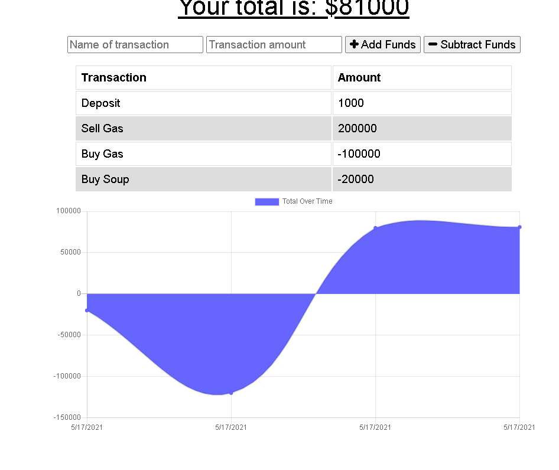
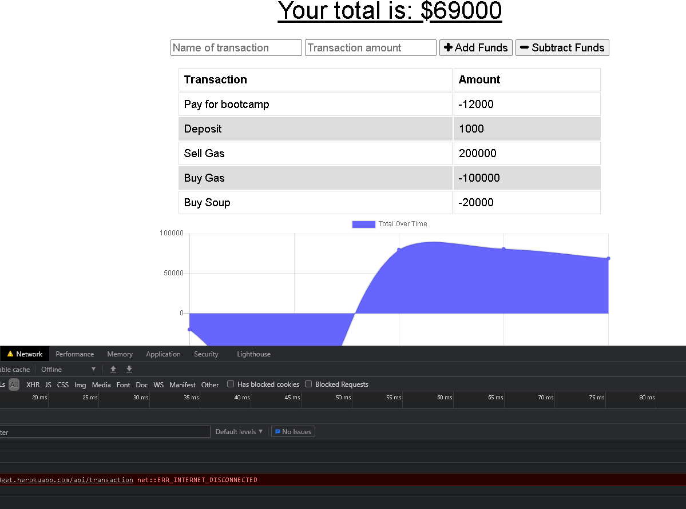

# Progressive-Budget
  

  ## Description 
Budget Tracker application to allow for offline access and functionality.
  ## Table of Contents 
  * [Installation](#installation) 
  * [Usage](#Usage)
  * [License](#License)
  * [Contributing](#Contributing)
  * [Testing](#Testing)
  * [Contact](#Contact)
  
  # Installation
  To install use the following code:
   npm i

  # Screenshots
    Online Behavior
   
    Offline Behavior
   
  

  # Usage
  use git clone
  
  # License
    This project is created under the MIT license

  # Contributing
  Create a pull request

  # Testing
  none

  # Contact
  If you have questions or concerns, please contact me at the following: 

  GitHub: MooreFL 

  Email: moorepr09@gmail.com 
